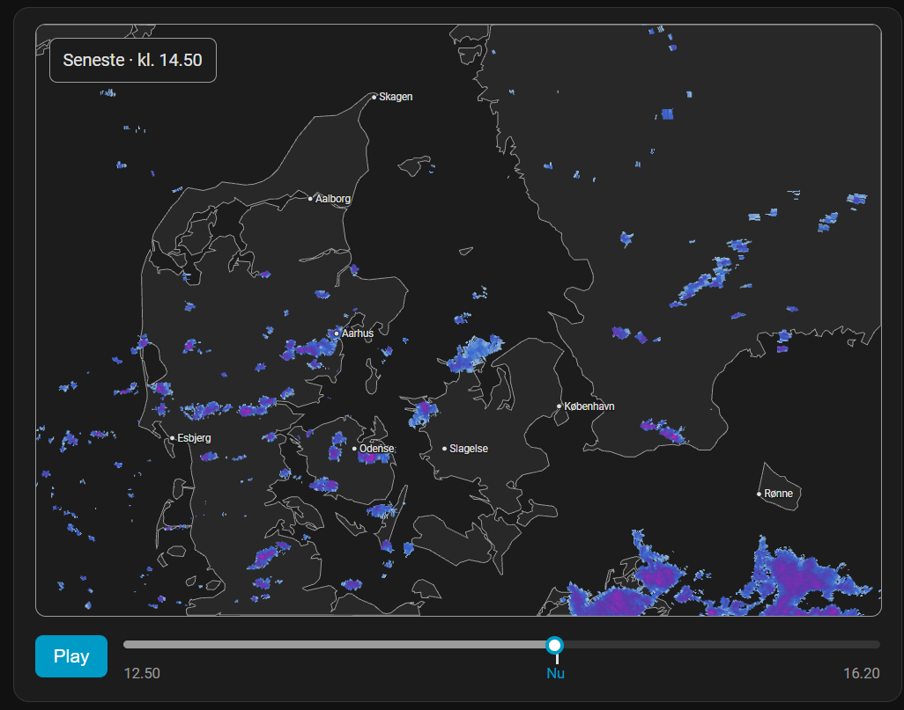

# DMI Vejrradar

A Home Assistant integration showing live Danish precipitation radar: the
last ~2 hours of observed rainfall and up to ~90 minutes of forecast (an
FFT-based advection nowcast), on a detailed Denmark basemap, with a
scrub/play timeline.

Built on DMI's official Open Data radar composites (CC BY 4.0) — decoded,
reprojected, colorized and extrapolated entirely on your own Home
Assistant instance. No external server to host: install the integration
and its matching Lovelace card comes with it.



## Installation

### HACS (custom repository)

This isn't in HACS's default store, so add it as a custom repository:

1. HACS → the "⋮" menu → **Custom repositories**.
2. Repository: `https://github.com/dottore1/weather-radar`, category **Integration**.
3. Install **DMI Vejrradar**, then restart Home Assistant.
4. Settings → Devices & Services → **Add Integration** → search for
   "DMI Vejrradar". No configuration needed — it covers Denmark as a whole,
   and DMI's radar Open Data needs no API key.

The matching Lovelace card is registered automatically once the
integration is set up — no manual "add resource" step.

### Manual

Copy `custom_components/weather_radar_dmi/` into `<config>/custom_components/`,
restart Home Assistant, then add the integration as above.

## Usage

Add a card with:

```yaml
type: custom:weather-radar-dmi-card
```

The card fetches from this integration's own endpoints (same-origin, using
your existing HA session), which are backed by a background poll every 2
minutes. Two options are available from the card's own Config tab in the
dashboard editor (both default to on):

- **Autoplay** — start the timeline playing automatically.
- **Show home location marker** — a red marker at your configured Home
  Assistant location (Settings → System → General).

## Running the tests

See [`tests/README.md`](tests/README.md).

## Notes

- Radar data typically lags real time by 15–25 minutes; that's DMI's own
  processing delay, not a bug.
- `h5py` and `pyproj` (needed to decode DMI's raw HDF5 composites and
  reproject them) are less common Home Assistant dependencies than
  `numpy`/`Pillow` and pull in compiled extensions — should install cleanly
  from wheels on standard HAOS/Container images, but this is worth knowing
  if setup ever fails on an unusual platform.
- `dev/` is a separate local-only test harness (no Home Assistant involved)
  used to build and tune the rendering/nowcast pipeline before it was
  ported into `custom_components/weather_radar_dmi/`. See
  [`CLAUDE.md`](CLAUDE.md) for the architecture/decision history.
